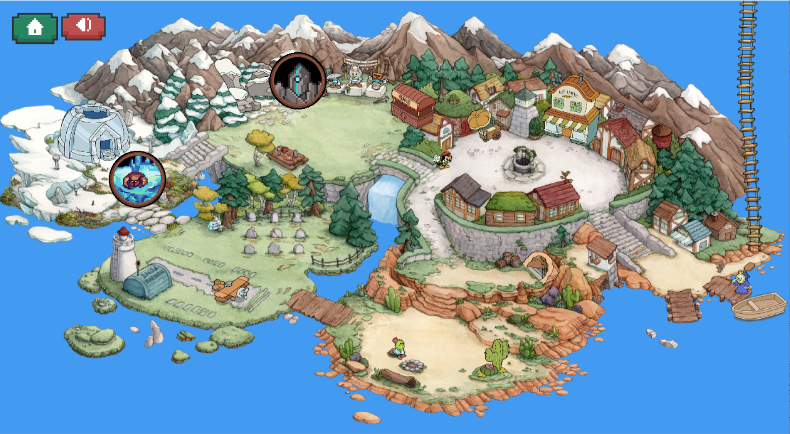

# Souls Lite
- Demo Game: https://drive.google.com/drive/folders/1tLLu-VD7AAYrsk0CF_Vzmhb-YG6pFszk?usp=drive_link
- Link Github: https://github.com/Darkinz05/Project-Game

# Giới thiệu:
Chào mừng đến với thế giới của Souls Lite - nơi mà sự kiên nhẫn và kỹ năng sẽ được thử thách đến cực hạn. Trong trò chơi này, bạn sẽ bước vào một cuộc hành trình đầy cam go, với chỉ một thanh kiếm và sự nhanh nhẹn của mình, bạn sẽ phải tìm cách đánh bại những con Boss xấu xa để mang lại bình yên cho ngôi làng.

- [0. Cách tải game](#0-cách-tải-game)
- [1. Bắt đầu game](#1-bắt-đầu-game)
- [2. Các thành phần trong game](#2-các-thành-phần)
- [3. Cách chơi](#3-cách-chơi)
- [4. Chiến thắng và thất bại](#4-chiến-thắng-và-thất-bại)
- [Credits](#credit)

# 0. Cách tải game

**Bước 1:** Tại Repo này, Chọn Code -> Download Zip (192 MB). File khá lớn do bao gồm cả các thư viện SDL cần thiết.

**Bước 2:** Sử dụng phiên bản Code::Block 32 bit. Do thư viện SDL mình dùng là loại 32 bit.

**Bước 3:**
- Giải nén project vào 1 thư mục.
- Chạy Project.cbp trong thư mục đó.
- Build and run trong Code::Block (hoặc có thể thử chạy bằng Debug nếu không được).

**Bước 4:** Bắt đầu trò chơi.

# 1. Bắt đầu game

Bắt đầu trò chơi sẽ là menu như dưới hình:
- Play: Chuyển sang menu chọn Level
- Tutorial: Hướng dẫn cách chơi
- Achievements: Hệ thống thành tựu
- Reset: Làm mới tiến trình chơi

Đây là Menu chọn level:
- Level 1: Khu vực tuyết, là lãnh địa của Frost Guardian.
- Level 2: Khu vực hang, là lãnh địa của Stone Golem. Level 2 ban đầu sẽ bị khóa, người chơi cần vượt qua level 1 để có thể mở khóa level 2.

# 2. Các thành phần trong game

- Player : nhân vật của bạn
- Boss Frost Guardian : Boss 1, là một người tuyết khổng lồ sống một mình trong lều tuyết, tập gym hàng ngày nên có một cơ thể rất to.
- Boss Stone Golem : Boss 2, là một thực thể năng lượng huyền bí bị giằng xé trong những mảnh vỡ thiên thạch.
- Ngoài ra, còn có những vật thể khác do Boss tạo ra để tấn công bạn. Hãy cẩn thận!
- Hệ thống thành tựu:

- Nút Home : dùng để pause hoặc quay về menu.
- Nút Âm thanh : dùng để tắt/bật âm thanh
- Bố cục game cơ bản:

# 3. Cách chơi

Bạn có thể học cách chơi trong game thông qua Tutorial.

Sử dụng phím A để sang trái và phím D để sang phải.

Sử dụng phím W để nhảy. Giữ W để nhảy cao hơn.

Sử dụng phím J để đánh thường. Phím K để lướt một đoạn.

Mục tiêu của bạn là đánh cho Boss về 0 máu và bạn sẽ dành chiến thắng. Ngược lại, nếu bạn hết máu bạn thua.

Dưới đây là đặc điểm của từng boss

**Boss 1**
- Frost Guardian sẽ có 3 cách tấn công chính:
    - Tìm kiếm và tung nắm đấm.
    - Đấm ra một đạn băng về phía bạn.
    - Bắn 3 cột băng lên trời và nó sẽ rơi xuống đầu bạn.

**Boss 2**
- Stone Golem cũng có 3 cách tấn công chính:
    - Tạo xung điện trường gây sát thương quanh bản thân
    - Bay về một phía và bắn bàn tay hỏa tiễn về phía bạn. Lưu ý, bàn tay hỏa tiễn sau một đoạn sẽ quay ngược về vị trí cũ.
    - Bao bọc bản thân bằng lớp giáp kiên cố. Trong thời gian này, Stone Golem sẽ tạo rung chấn làm cho các lớp đá trong hang rơi xuống. Lưu ý, nếu bạn tấn công Stone Golem, hắn sẽ hồi máu.
- Đặc biệt, Stone Golem có 2 dạng. Hắn sẽ chuyển dạng sau khi mất đi nửa số sinh mệnh. Lúc này hắn sẽ vô cùng nguy hiểm.

# 4. Chiến thắng và thất bại
Đánh bại boss và thu thập linh hồn của chúng, bạn sẽ chiến thắng.

Nếu bạn hết máu, bạn sẽ thua.

# Credits
### Về đồ họa của game:
- Player : https://rvros.itch.io/
- Boss 1 : https://chierit.itch.io/
- Boss 2 : https://darkpixel-kronovi.itch.io/
- Dummy  : https://elthen.itch.io/
Thanks for providing free useful resources.
### Về nhạc nền:
- Menu : The Legend of Zelda (Main theme).
- Map 1: Hollow Knight's Nightmare King.
- Map 2: Hollow Knight's Sisters of Battle.
### Về source code:

Mình có tham khảo và sử dụng code của kênh Youtube: https://www.youtube.com/@PhatTrienPhanMem123AZ vào các file CommonFunc, BaseObject, Bullet,... và học được cách xây dựng tương tác với Map cho Player.
Các file còn lại đều là mình tự code và phát triển.

